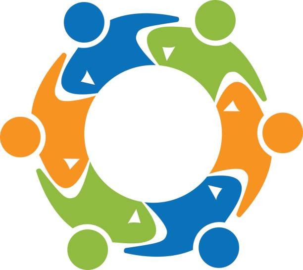

# ProjectApp

An app for a group of friends.

The idea is to make an app where every person in the group can create an account linked to a groups name.
In this app you can pick a date for a holiday or something like that.
And there is an option to fill in what you have payed an how many. So this app calculate which friend has to pay to who.

De pictogram wordt dit:

  
